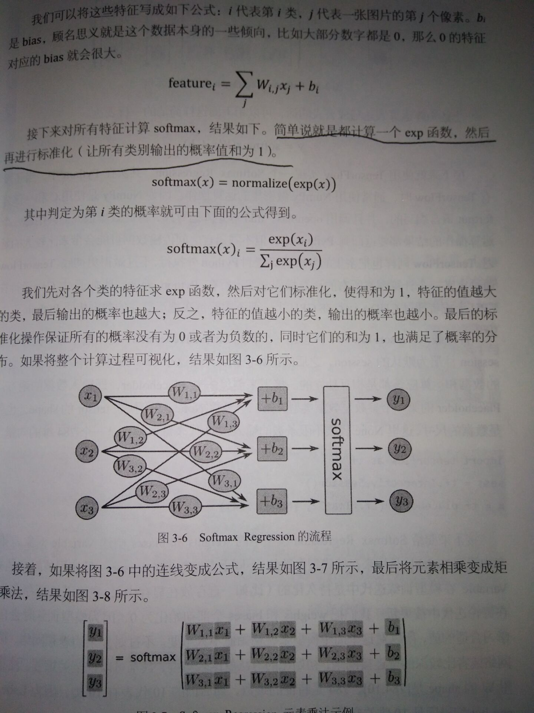
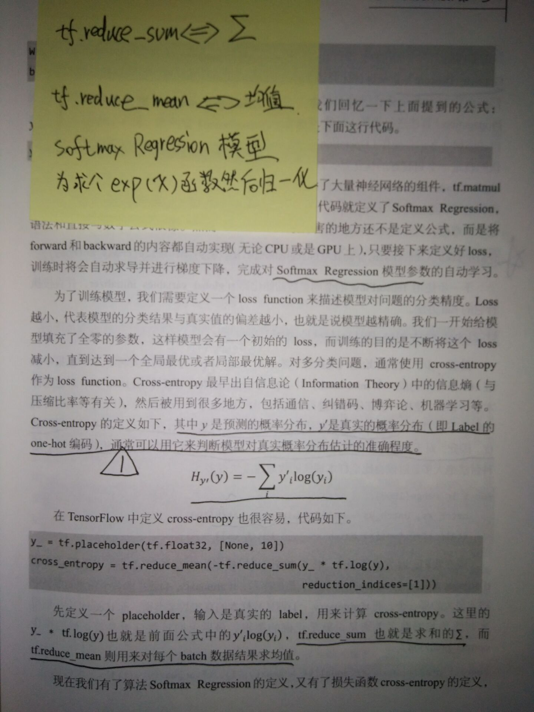
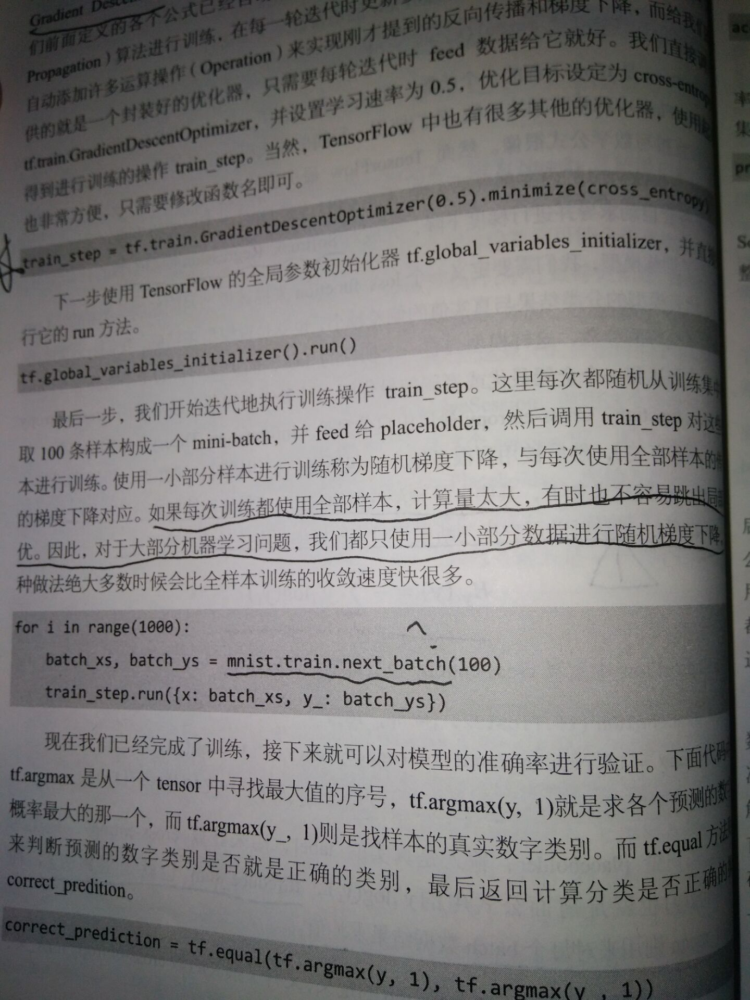
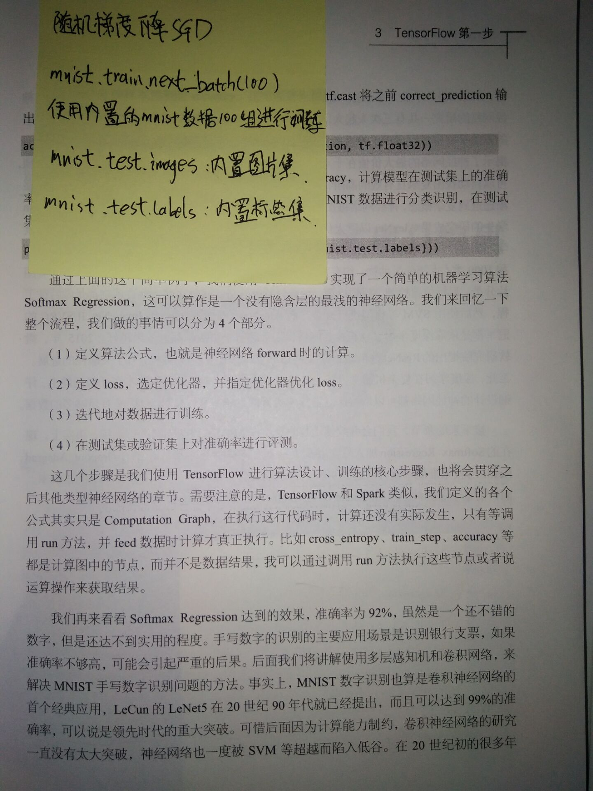

<h1>前言</h1>
&nbsp;&nbsp;&nbsp;&nbsp;在这个人工智能盛行的时代，希望有更多的小伙伴和我一起，在这条路上分享各自的经验。也请大牛们多多关照，您的宝贵意见一定能促使我成为一名优秀的人工智能开发者。 

<h1>Softmax Regression</h1>
&nbsp;&nbsp;&nbsp;&nbsp;作为人工智能学院的小生，跨出了第一步，写了第一个模型，该模型是tensorflow实战中第一个例子,选用信息熵作为损失函数再加上一次L2正则化，加入隐含层偏执成为一个正统的神经网络。(数学原理压力大的还请补补高数吧 ― ―！)

* **数据集**：github上下载的MNIST数据
* **源码**：源于tensorflow实战书中的第一个例子的扩展
* **笔记**：

| | |
| -------- | -------- | 
|   |     |
|   |     | 

